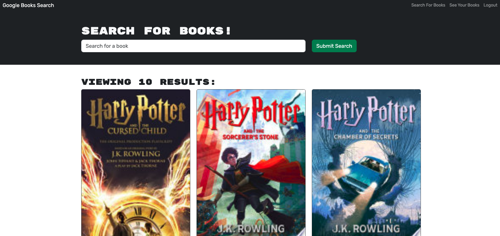
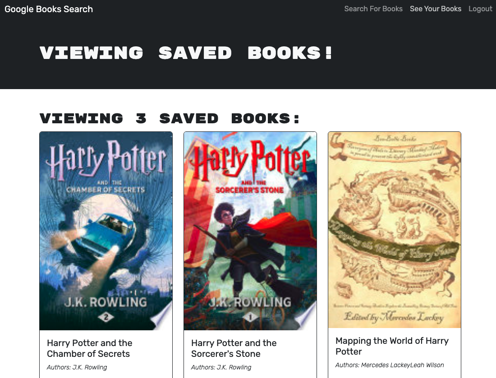

# MERN Challenge: Book Search Engine

## Table of Contents 
- [Description](#description) 
- [Installation](#installation)
- [Usage](#usage)
- [Testing](#testing)
- [Technologies](#technologies)
- [Contribution](#contribution)
- [Examples](#examples)
- [License](#license)
- [Questions](#questions)

## Description 
The Book Search Engine is a full-stack web application built using the MERN (MongoDB, Express.js, React, Node.js) stack. Originally utilizing a RESTful API, it has been refactored to implement a GraphQL API powered by Apollo Server. This application allows users to search for books using the Google Books API, save them to their account, and manage their saved books. Authentication is implemented to allow users to sign up, log in, and log out securely.

## Installation 
To view and interact with the portfolio:

- Clone the repository from GitHub to your local machine.
- Navigate to the root directory and run npm install to install dependencies for both the server and the client.
- Create a .env file in the root directory and add your MongoDB connection string as - MONGODB_URI and your JWT secret as JWT_SECRET.
- Run npm start to concurrently start the server and the React application.

## Usage 
- Open your browser and navigate to http://localhost:3000 to use the Book Search Engine.
- Use the search bar to find books via the Google Books API.
- Sign up or log in to save books to your account.
- View and manage your saved books through the saved books page.
Or: 
- visit the deployed site: https://book-searchengine.onrender.com 

## Testing 
    Testing information to be added when developed.

## Technologies Used 

- React
- Apollo Server
- GraphQL
- Node.js
- Express.js
- MongoDB
- Bootstrap (React-Bootstrap)
- JWT Authentication
- Google Books API

## Contribution

- Web-dev-projects: https://github.com/judygab/web-dev-projects.git
- BootCampSpot Tutoring Services
- Mini Project: Bucket List

## Examples  

## License 
    N/A

## Questions 
    For any questions, please contact [jovanna24](https://github.com/jovanna24) at jovannajimenez1124@gmail.com.
